# Database Schema Diagram

## Overview
This document contains the Entity-Relationship (ER) diagram for the Startup Marketplace Platform database schema. The diagram shows all tables, their fields, data types, and relationships.

## ER Diagram

```mermaid
erDiagram
    User ||--o| UserProfile : "has (OneToOne)"
    User ||--o| UserOnboardingPreferences : "has (OneToOne)"
    User ||--o{ Startup : "owns (OneToMany)"
    User ||--o{ Application : "applies (OneToMany)"
    User ||--o{ Notification : "receives (OneToMany)"
    User ||--o{ Favorite : "favorites (OneToMany)"
    User ||--o{ Interest : "expresses interest (OneToMany)"
    User ||--o{ FileUpload : "uploads (OneToMany)"
    User ||--o{ Message : "sends (OneToMany)"
    User ||--o{ UserInteraction : "interacts (OneToMany)"
    User }o--o{ Conversation : "participates (ManyToMany)"
    
    Startup ||--o{ StartupTag : "has tags (OneToMany)"
    Startup ||--o{ Position : "has positions (OneToMany)"
    Startup ||--o{ Application : "receives applications (OneToMany)"
    Startup ||--o{ Favorite : "favorited by (OneToMany)"
    Startup ||--o{ Interest : "interested in (OneToMany)"
    Startup ||--o{ UserInteraction : "interacted with (OneToMany)"
    Startup ||--|| StartupTrendingMetrics : "has metrics (OneToOne)"
    
    Position ||--o{ Application : "receives applications (OneToMany)"
    Position ||--o{ UserInteraction : "interacted with (OneToMany, optional)"
    
    Conversation ||--o{ Message : "contains messages (OneToMany)"

    User {
        uuid id PK
        string email UK "unique, required"
        string username UK "unique, required"
        string password "hashed"
        string first_name
        string last_name
        boolean is_superuser
        boolean is_staff
        boolean is_active
        boolean email_verified
        string role "choices: entrepreneur, student, investor"
        string phone_number
        datetime last_login
        datetime date_joined
        text profile_embedding "JSON string"
        string embedding_model "default: all-MiniLM-L6-v2"
        int embedding_version "default: 1"
        datetime embedding_updated_at
        datetime created_at
        datetime updated_at
    }

    UserProfile {
        uuid user_id PK "OneToOne with User"
        text bio
        string location "max_length: 100"
        url website
        image profile_picture "upload_to: profiles/"
        boolean is_public
        json selected_regions "array"
        json skills "array"
        json experience "array"
        json references "array"
        boolean onboarding_completed
        json preferred_work_modes "array"
        json preferred_compensation_types "array"
        datetime created_at
        datetime updated_at
    }

    UserOnboardingPreferences {
        uuid id PK
        uuid user_id FK "OneToOne with User"
        json selected_categories "array"
        json selected_fields "array"
        json selected_tags "array"
        json preferred_startup_stages "array"
        json preferred_engagement_types "array"
        json preferred_skills "array"
        boolean onboarding_completed
        datetime created_at
        datetime updated_at
    }

    Startup {
        uuid id PK
        uuid owner_id FK "references User"
        string title "max_length: 200, min_length: 5"
        string role_title "max_length: 100"
        text description "min_length: 20"
        string field "max_length: 100"
        url website_url
        json stages "array"
        string revenue "max_length: 50"
        string profit "max_length: 50"
        string asking_price "max_length: 50"
        string ttm_revenue "max_length: 50"
        string ttm_profit "max_length: 50"
        string last_month_revenue "max_length: 50"
        string last_month_profit "max_length: 50"
        string earn_through "max_length: 50"
        string phase "max_length: 50"
        string team_size "max_length: 50"
        string type "choices: marketplace, collaboration"
        string category "choices: saas, ecommerce, agency, legal, marketplace, media, platform, real_estate, robotics, software, web3, crypto, other"
        string status "choices: active, inactive, sold, paused"
        int views "default: 0"
        boolean featured
        text profile_embedding "JSON string"
        string embedding_model "default: all-MiniLM-L6-v2"
        int embedding_version "default: 1"
        datetime embedding_updated_at
        datetime created_at
        datetime updated_at
    }

    StartupTag {
        uuid id PK
        uuid startup_id FK "references Startup"
        string tag "max_length: 100"
    }

    Position {
        uuid id PK
        uuid startup_id FK "references Startup"
        string title "max_length: 100"
        text description
        text requirements
        boolean is_active
        datetime created_at
    }

    Application {
        uuid id PK
        uuid startup_id FK "references Startup"
        uuid position_id FK "references Position"
        uuid applicant_id FK "references User"
        text cover_letter
        text experience
        url portfolio_url
        url resume_url
        string status "choices: pending, approved, rejected, withdrawn"
        text notes
        datetime created_at
        datetime updated_at
    }

    Notification {
        uuid id PK
        uuid user_id FK "references User"
        string type "choices: application_status, new_application, pitch, general"
        string title "max_length: 200"
        text message
        json data "object"
        boolean is_read
        datetime created_at
    }

    Favorite {
        uuid id PK
        uuid user_id FK "references User"
        uuid startup_id FK "references Startup"
        datetime created_at
    }

    Interest {
        uuid id PK
        uuid user_id FK "references User"
        uuid startup_id FK "references Startup"
        text message
        datetime created_at
    }

    Conversation {
        uuid id PK
        string title "max_length: 200"
        boolean is_active
        datetime created_at
        datetime updated_at
    }

    Message {
        uuid id PK
        uuid conversation_id FK "references Conversation"
        uuid sender_id FK "references User"
        text content
        string message_type "choices: text, image, file"
        file attachment "upload_to: messages/"
        boolean is_read
        datetime created_at
    }

    FileUpload {
        uuid id PK
        uuid user_id FK "references User"
        file file "upload_to: uploads/"
        string file_type "choices: resume, startup_image, profile_picture, message_attachment, other"
        string original_name "max_length: 255"
        bigint file_size
        string mime_type "max_length: 100"
        boolean is_active
        datetime created_at
    }

    UserInteraction {
        uuid id PK
        uuid user_id FK "references User"
        uuid startup_id FK "references Startup"
        uuid position_id FK "references Position, optional"
        string interaction_type "choices: view, click, like, dislike, favorite, apply, interest"
        float weight "computed on save"
        json metadata "object"
        datetime created_at
    }

    StartupTrendingMetrics {
        uuid id PK
        uuid startup_id FK "OneToOne with Startup"
        float popularity_score "30-day window"
        float trending_score "7-day window"
        int view_count_24h
        int view_count_7d
        int view_count_30d
        int application_count_24h
        int application_count_7d
        int application_count_30d
        int favorite_count_7d
        int interest_count_7d
        int active_positions_count
        float velocity_score
        datetime computed_at
    }

    RecommendationModel {
        uuid id PK
        string model_name "max_length: 50"
        string use_case "choices: developer_startup, founder_developer, founder_startup, investor_startup"
        string model_type "choices: content_based, als, two_tower, ranker"
        string file_path "max_length: 500"
        json training_config "object"
        json performance_metrics "object"
        boolean is_active
        datetime trained_at
        datetime created_at
    }
```

## Table Descriptions

### Core Tables

#### User
The central authentication and user account table. Extends Django's AbstractUser with custom fields including role (entrepreneur, student, investor), phone number, and embedding fields for recommendation system.

**Key Fields:**
- `id`: UUID primary key
- `email`: Unique email used for login (USERNAME_FIELD)
- `role`: User type (entrepreneur, student, investor)
- `profile_embedding`: JSON string of embedding vector for recommendations

#### Startup
Startup listings for both marketplace (for sale) and collaboration (job opportunities) types. Contains financial data for marketplace listings and collaboration details for job postings.

**Key Fields:**
- `id`: UUID primary key
- `owner`: Foreign key to User (startup creator)
- `type`: Either 'marketplace' or 'collaboration'
- `category`: Industry category (saas, ecommerce, etc.)
- `status`: Listing status (active, inactive, sold, paused)
- `profile_embedding`: JSON string of embedding vector

#### Application
Applications submitted by users for startup positions. Links User (applicant), Startup, and Position.

**Key Fields:**
- `id`: UUID primary key
- `startup`: Foreign key to Startup
- `position`: Foreign key to Position
- `applicant`: Foreign key to User
- `status`: Application status (pending, approved, rejected, withdrawn)

**Constraints:**
- Unique together: (startup, applicant) - User can only apply once per startup

### Messaging System

#### Conversation
Conversations between multiple users. Uses Many-to-Many relationship with User through participants.

#### Message
Individual messages within conversations. Contains text content, optional attachments, and read status.

### Recommendation System

#### UserInteraction
Unified interaction tracking for recommendation system. Tracks all user interactions with startups (views, clicks, likes, favorites, applications, etc.) with weighted scores.

**Interaction Types:**
- `view`: Weight 0.5
- `click`: Weight 1.0
- `like`: Weight 2.0
- `dislike`: Weight -1.0 (negative signal)
- `favorite`: Weight 2.5
- `apply`: Weight 3.0
- `interest`: Weight 3.5

**Constraints:**
- Unique together: (user, startup, interaction_type) - One interaction per type per user-startup pair

#### StartupTrendingMetrics
Computed trending and popularity metrics for startups. Updated periodically with view counts, application counts, and engagement metrics across different time windows (24h, 7d, 30d).

#### UserOnboardingPreferences
Initial user preferences collected during onboarding for cold-start recommendations. Stores selected categories, fields, tags, and preferred engagement types.

#### RecommendationModel
Metadata for machine learning models used in the recommendation system. Tracks model type, use case, performance metrics, and training configuration.

### Engagement Tables

#### Favorite
User saves/bookmarks a startup (investor engagement feature).

**Constraints:**
- Unique together: (user, startup) - User can only favorite a startup once

#### Interest
Investor expresses interest in a startup with optional message.

**Constraints:**
- Unique together: (user, startup) - User can only express interest once per startup

## Relationship Summary

### One-to-One Relationships
- User ↔ UserProfile
- User ↔ UserOnboardingPreferences
- Startup ↔ StartupTrendingMetrics

### One-to-Many Relationships
- User → Startup (owner)
- User → Application (applicant)
- User → Notification (recipient)
- User → Favorite (user)
- User → Interest (user)
- User → FileUpload (uploader)
- User → Message (sender)
- User → UserInteraction (user)
- Startup → StartupTag (startup)
- Startup → Position (startup)
- Startup → Application (startup)
- Startup → Favorite (startup)
- Startup → Interest (startup)
- Startup → UserInteraction (startup)
- Position → Application (position)
- Position → UserInteraction (position, optional)
- Conversation → Message (conversation)

### Many-to-Many Relationships
- User ↔ Conversation (participants)

## Indexes

### User
- `email` (for login lookups)
- `username` (for username lookups)
- `role` (for filtering by user type)

### Startup
- `owner` (for owner queries)
- `type` (for filtering by listing type)
- `category` (for category filtering)
- `status` (for status filtering)
- `created_at` (for sorting)

### Application
- `startup` (for startup queries)
- `applicant` (for user queries)
- `status` (for status filtering)

### UserInteraction
- `(user, startup, created_at)` (for user interaction history)
- `(startup, created_at)` (for startup analytics)
- `interaction_type` (for filtering by type)
- `position` (for position-specific analytics)

### StartupTrendingMetrics
- `-popularity_score` (for sorting popular startups)
- `-trending_score` (for sorting trending startups)

## Notes

- All primary keys use UUID v4 (except UserProfile which uses user_id as PK)
- All timestamps use `auto_now_add=True` for creation and `auto_now=True` for updates
- Foreign keys use `CASCADE` delete (deleting parent deletes children), except Position in UserInteraction which uses `SET_NULL`
- Many-to-Many relationships use junction tables (Conversation-User via Django's ManyToManyField)
- JSON fields store arrays/objects for flexible data (stages, skills, experience, preferences, etc.)
- Embedding fields store JSON strings of vector embeddings for recommendation system
- Unique constraints prevent duplicate entries (e.g., one favorite per user-startup pair)

